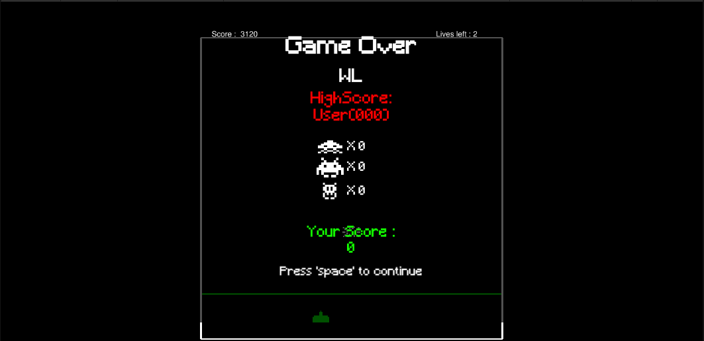

# SpaceInvaders

Ce jeu a été réalisé dans le cadre du cours 420-455-AL programmation appliquée en simulation ou jeux du Cégep André-Laurendeau.

L'objectif était de créer une copie du jeu SpaceInvaders dans le cadre du cours et du nombre de temps alloué pour la réalisation de ce projet.

Voici quelques Images:

<small>PS¹: Les menus contenants des boutons ou les informations de jeu, ne sont pas finis.</small>

<small>PS²: J'ai fait un petit nettoyage du code et j'ai corrigé en même temps les erreurs flagrante que j'ai fait, mais j'ai laissé la logique d'origine et je ne pense pas que je vais retoucher à ce projet.</small>
